

<h3>Project Showcase</h3>
<h1>Invicta!<h1>
<h3>Mason Gossy</h3>

<h2>Introduction</h2>

My project is broken up into 2 major parts, documentation and visual coding(scripting/blueprints) both played their own unique role in the development process of this project.

Inspiration for this project was driven from Epic Games MOBA(multiplayer online battle arena) game Paragon, which was shut down for financial reasons and in doing so they also released all the assets for free on their game engine, Unreal. These assets are a perfect template for young game developers with limited skills because they provide all the triple A potential, you just need to figure out how to put the pieces(code) back together for things to function properly.

When it came to preparation I knew documentation was going to keep my project organized. Documentation is well practiced in the game industry, and I found that timelines, game design documents and developer notes are the three most important documents to keep track of.

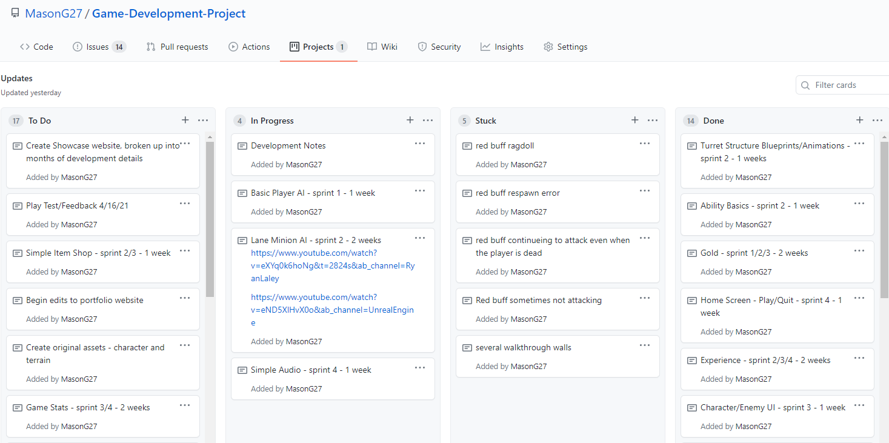

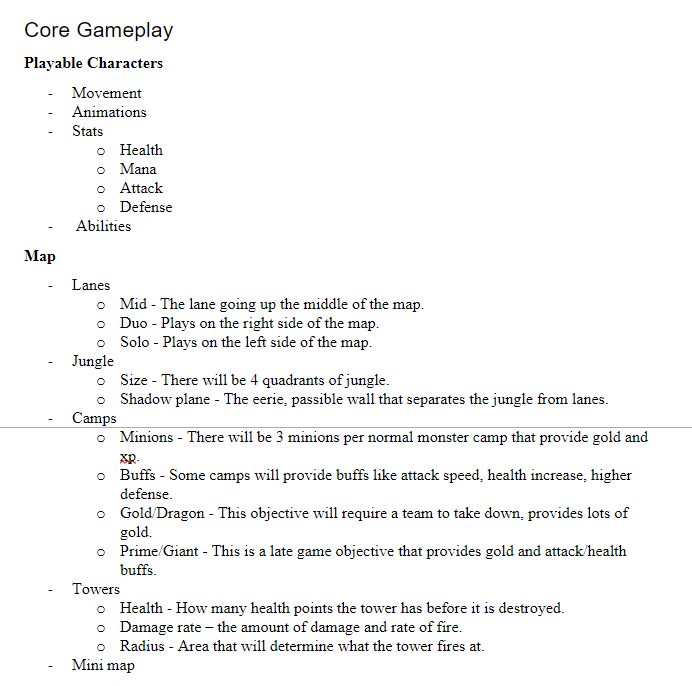

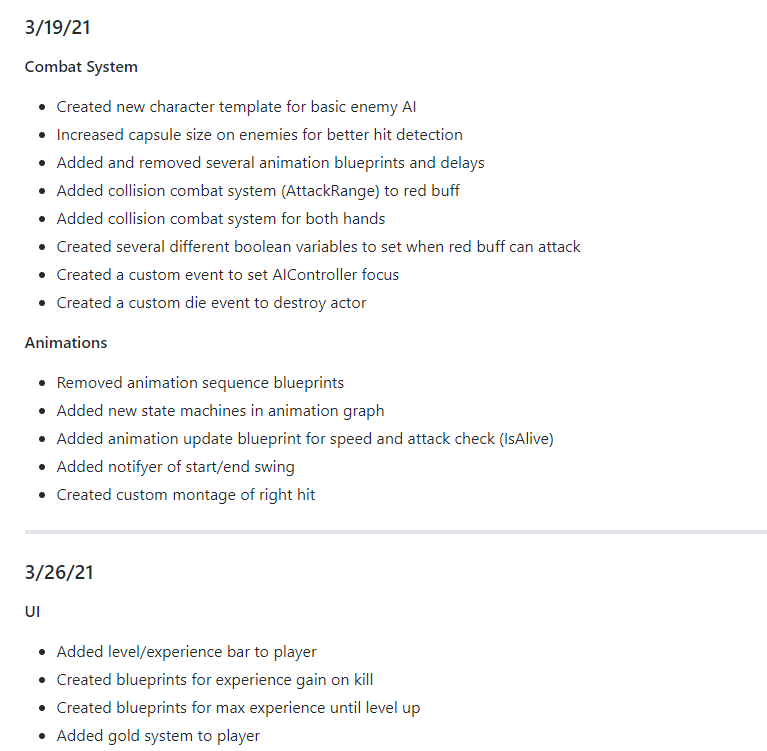

<h2>Month 1 - Map and Environment Design</h2>

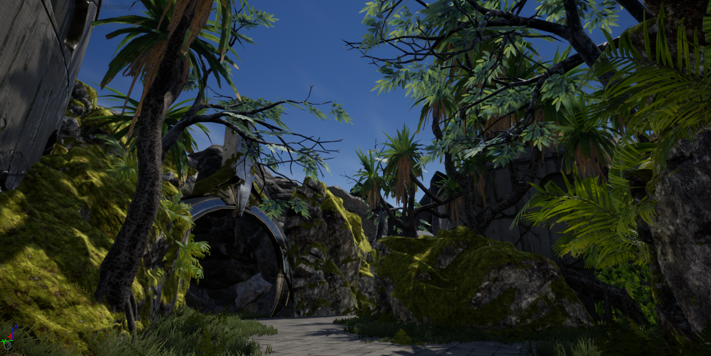

Although I spent about 25% of development time on environment design, I believe it was a good idea because it allowed me to show my potential as an environment artist. Additionally, it shows professional design techniques since each lane, jungle path and camp had to be strategically placed in order to make sure each side was evenly matched. This was achieved by countless play testing, measuring and timing.

Having a lot of experience from playing this type of game gave me a great stepping stone in designing the map. MOBAS traditionally have 2 bases that each have 5 players start in. The objective is to destroy the opponents base core, each base is separated by 3 lanes and a jungle. Giving each character roles to take part in throughout the match. The five roles are Mid, Jungle, Solo, as well as the ADC(all damage carry) and Support, which play together in their designated lane.

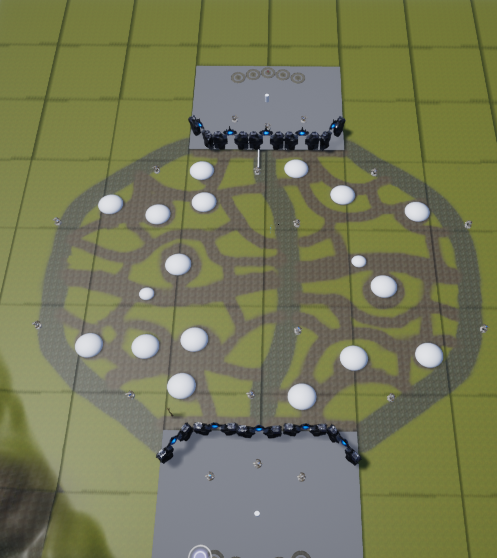

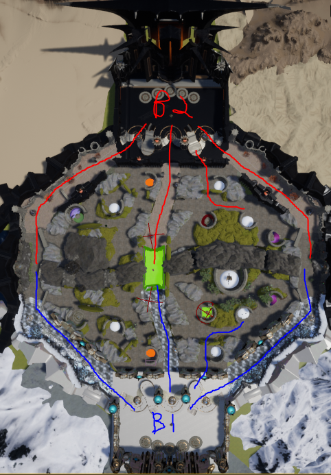

<h2>Month 2 - Combat System and Character Stats</h2>

About a month into the project I began exploring different ways of starting a combat system. I ended up settling on a tag system for detection and overlap collision for damage.

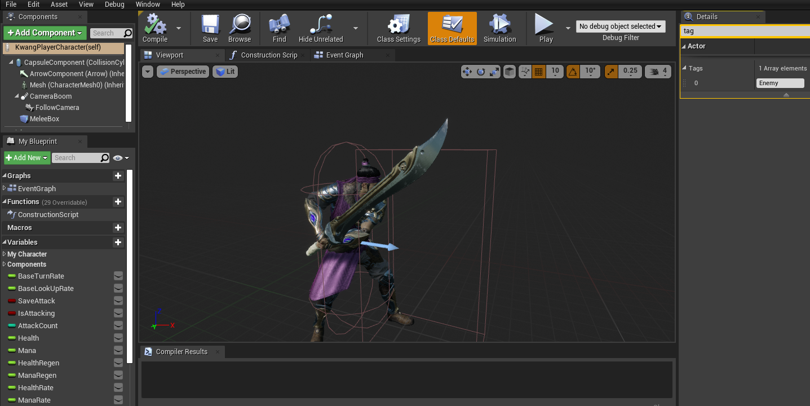

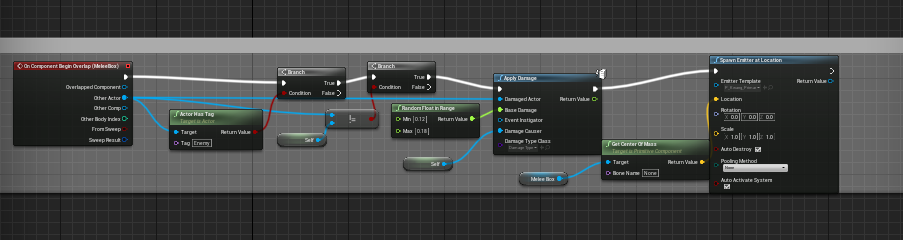

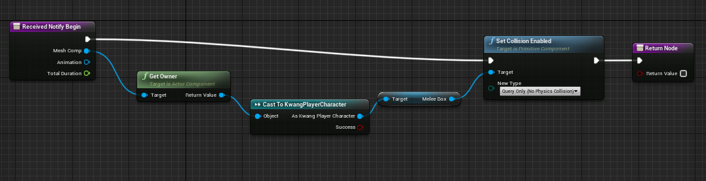

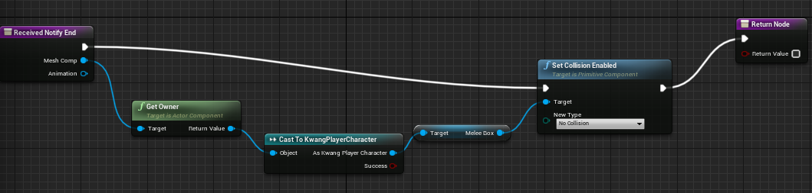

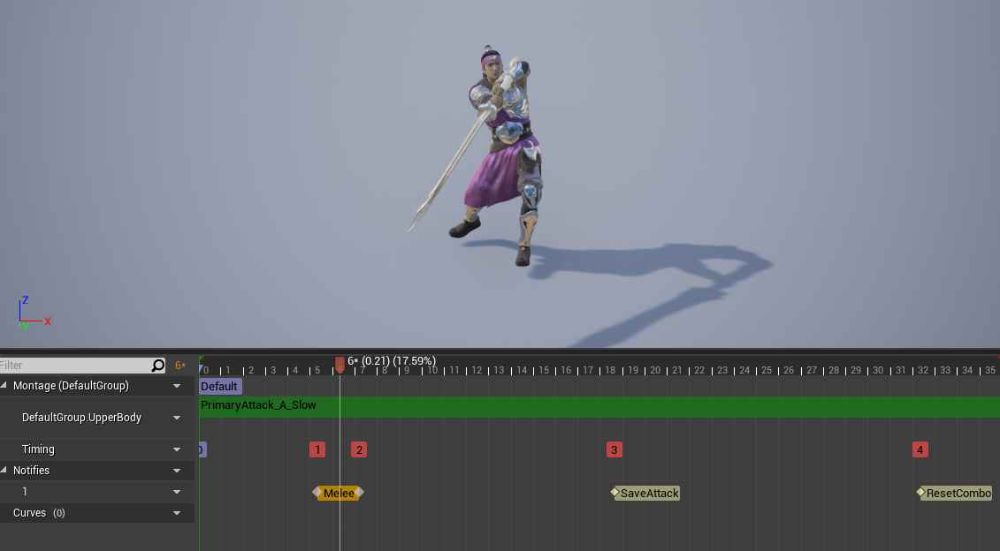

The great thing about this combat system is the tagging allows for you to easily do damage to multiple enemies by just adding a tag to them. A great example is the turrets, all I had to do was give them a health variable and tag them as an enemy and boom, they are able to take damage from the player. The reason this is important is it saves so much time instead of reimplamenting the same blueprint and having to adjust different variables.
 

Once I got my basic damage system setup it was time to design and add functionality to an enemy. I started with the red buff camp, MOBAS have small areas in the jungle called camps which have monsters that help your character gain experience and gold when killed.

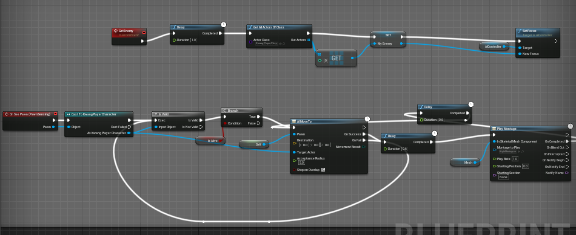

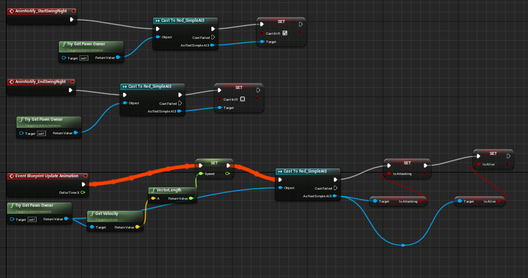

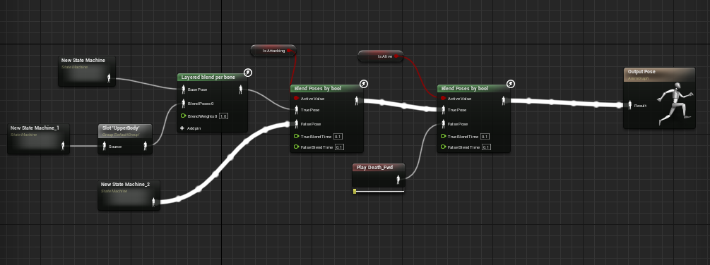

